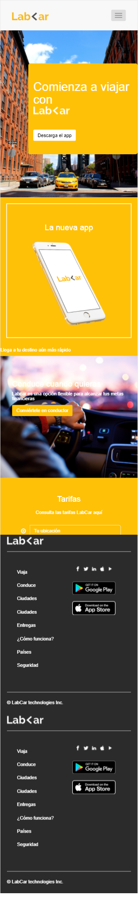

* **Track:** _Common Core_
* **Curso:** _Creando tu primera red social_
* **Unidad:** _No reinventes la rueda_

***

##Reto

El reto consiste en recrear **Lab<Car**. El trabajo debe verse de esta forma:  

## Objetivos del reto

El reto consiste en:

* Crear una web que sea responsiva.
* Usar Grid System y Media Query.
* Implementar `gh.pages`

## Logro

## Herramientas usadas

* HTML 

* CSS 

* Grid System 

* Media Query 